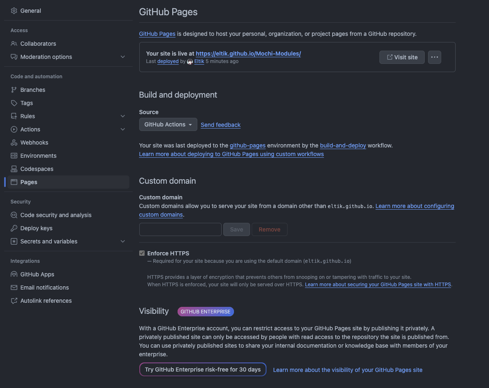

# Mochi Repository

### Usage
1. Run the following commands:
```bash
pnpm i
pnpm check
pnpm bundle --site
```
2. Setup GitHub pages. Make sure it's enabled. Under `Build and deployment`, the `Source` dropdown should be "GitHub Actions".


[Anify](https://github.com/Eltik/anify-mochi/blob/main/README/character.png)